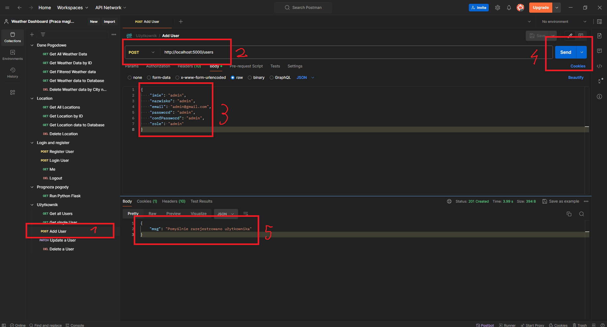

# Backend

## Wymagania:

- W folderze `backend`:

    * Wkleić do terminala ponizsze polecenie
        ```bash
        npm install
        ```

    * Stworzenie pliku `.env` oraz wklejenie poniżeszego kodu
        ```dosini
        APP_PORT = 5000
        APP_FLASK_PORT = 5001
        SESS_SECRET = losowy ciąg znaków
        DB_NAME = weather_dashboard_db
        DB_USER = postgres
        DB_PASSWORD = hasło dla użytkownika postgres
        DB_HOST = localhost
        DB_DIALECT = postgres
        ```

    * Stworzenie bazy danych w PostgreSQL o nazwie "weather_dashboard_db". Polecam do tego narzędzie `pgAdmin`

    * W pliku `index.js` odkomentować linijki `24`, `25`, `26` oraz `48` w celu stworzenia tabel, a po uruchomieniu backendu później zakomentować te same linijki

- W folderze `backend/FlaskPythonServer`

    - Tworzymy wirtualne środowisko

        ```bash
        py -3 -m venv venv
        ```

    - Uruchamiamy wirtualne środowisko
        ```bash
        source venv/Scripts/activate
        ```

    - Instalujemy biblioteki zapisane w pliku `requirements.txt`
        ```bash
        pip install -r requirements.txt
        ```

## Uruchomienie backendu (potrzeba dwóch terminali)

- Przechodzimy do folderu `backend`
    ```
    npm start
    ```

- Przechodzimy do folderu `backend/FlaskPythonServer`
    ```bash
    py app.py
    ```


## Co zrobić po uruchomieniu backendu?
Po uruchomieniu backendu należy użyć narzędzia [Postman](https://www.postman.com/) w celu dodania użytkownika z rolą admin.

Przykład poniżej

1. Dodać nowe `request` w programie `Postman`,
2. Wpisać URL taki jak na zdjęciu i ustawić typ na `Post`,
3. Wpisać dane logowania w formie `JSON` Tak jak na poniższym zdjęciu,
4. Nacisnąć przycisk `Send`,
5. Po pomyślnym wykonaniu poleceń powinien się wyświetlić komunikat ze pomyślnie dodano użytkownika.

